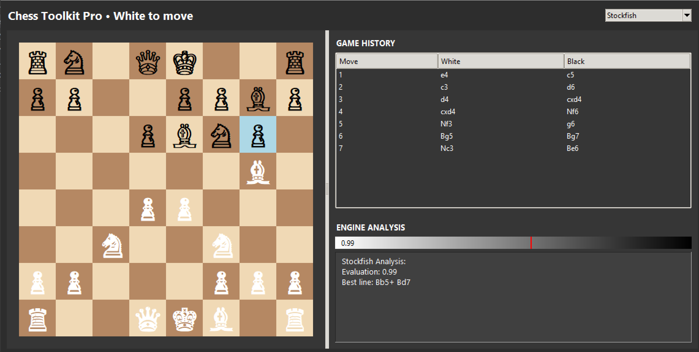

# Chess Toolkit Pro

Chess Toolkit Pro is a modern chess analysis and visualization tool designed for players and enthusiasts. It provides an interactive chessboard, game history tracking, and engine analysis to help you improve your chess skills.

## Features

- **Interactive Chessboard**: Play and analyze games with a visually appealing chessboard.
- **Game History**: View and navigate through the move history using a PGN tree.
- **Engine Analysis**: Leverage powerful chess engines like Stockfish, Komodo Dragon, Houdini, and Obsidian for position evaluation and best move suggestions.
- **Evaluation Bar**: Visualize the engine's evaluation of the current position with a gradient bar and numerical score.
- **Resizable Board**: The chessboard dynamically scales with the window size for an optimal experience.

## Requirements

- Python 3.8 or higher
- `python-chess` library
- `tkinter` (comes pre-installed with Python on most systems)

## Installation

1. Clone the repository:
   ```bash
   git clone https://github.com/yourusername/ChessToolkit.git
   cd ChessToolkit
   ```

2. Install dependencies:
   ```bash
   pip install python-chess
   ```

3. Ensure you have a compatible chess engine (e.g., Stockfish) in the `engines/` directory.

## Usage

1. Run the application:
   ```bash
   python main.py
   ```

2. Use the interactive chessboard to make moves. The engine will analyze the position and display evaluations.

3. Navigate through the game history using the PGN tree on the side panel.

4. Change the analysis engine using the dropdown menu in the header.

## File Structure

- `main.py`: Entry point for the application.
- `gui.py`: Contains the main GUI logic for the chessboard and side panels.
- `utils.py`: Utility functions for the application.
- `engines/`: Directory for chess engines (e.g., Stockfish).
- `README.md`: Documentation for the project.
- `LICENSE`: License information.

## License

This project is licensed under the MIT License. See the [LICENSE](./LICENSE) file for details.

## Screenshots



## Contributing

Contributions are welcome! Feel free to submit issues or pull requests to improve the project or email me at derekyuan10000@gmail.com

## Acknowledgments

- [python-chess](https://python-chess.readthedocs.io/) for providing a robust chess library.
- Chess engines like Stockfish for their powerful analysis capabilities.
